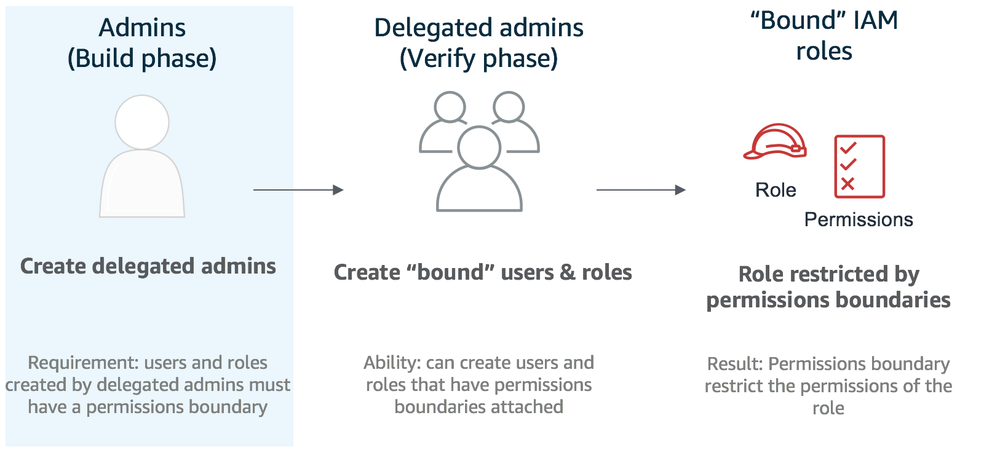

# Permissions boundary workshop <small> Advanced edition </small>
## Overview

Neste workshop você irá aprender como utilizar o recurso "permissions boundaries" para verdadeiramente delegar administração na AWS. Esta nova feature pode ser desafiadora mas este workshop provê um exercício prático que vai te ajudar a ser um mestre no assunto.

**AWS Service/Feature Coverage**: 

* AWS IAM <a href="https://docs.aws.amazon.com/IAM/latest/UserGuide/id.html" target="_blank">users & roles</a>
* AWS IAM <a href="https://docs.aws.amazon.com/IAM/latest/UserGuide/access_policies_boundaries.html" target="_blank">permissions boundaries</a> 
* AWS IAM <a href="https://docs.aws.amazon.com/IAM/latest/UserGuide/reference_identifiers.html" target="_blank">friendly names and paths</a>
* AWS <a href="https://docs.aws.amazon.com/lambda/latest/dg/welcome.html" target="_blank">Lambda</a>

Os três elementos principais do "permisisons boundary" estão representados a seguir. Quando você/seu time estiverem na fase de **CONSTRUÇÃO**, nesta seção vocês irão atuar como adminsitradores. Quando você/seu time estiverem na fase **VERIFICAÇÃO** vocês irão atuar como admnistradores delegados (webadmins).

### Cenário

A empresa em que você trabalha fez deploy de uma aplicação web três camadas na AWS. Vários times trabalham em diferentes aspectos da arquitetura incluindo os admisnistradores web (webadmins) que precisam ter a abilidade de criar Roles do IAM para funções Lambda. Para permitir que eles atuem de forma rápida foi decidido que seria utilizado "permissions boundaries" para delegar as permissões para os webadmins para que eles criem as roles sem a necessidade de solicitar esta tarefa para outros times. É sua tarefa criar as configurações e permissões necessárias para os webadmins e testá-las.

## Agenda

O workshop consiste de uma fase de <a href="./build/" target="_blank">**CONSTRUÇÃO**</a> seguida por uma fase de <a href="./verify/" target="_blank">**VERIFICAÇÃO**</a>

### Fases 
**CONSTRUÇÃO** (60 min): Primeiramente cada individuo/time atuará como o administrador da conta e executará as atividades relacionadas com a fase de **CONSTRUÇÃO** onde será criado o acesso para os administradores web.

E então cada individuo/time irá fornecer manualmente as credenciais da Role IAM para os webamins em suas contas para outro individuo/time realizar as tarefas da fase de **VERIFICAÇÃO**.

**VERIFICAÇÃO** (30 min): Na fase de **VERIFICAÇÃO** cada individuo/time irá atuar como webadmins validando que os requisitos foram configurados corretamente na fase de **CONSTRUÇÃO**.

!!! Informação "Exercício em time ou Individualemnte"
	Este workshop pode ser executado como exercício em time ou individualmente. Se realizado como parte de um evento AWS, então vocês provavelmente serão divididos em times entre 2-3 pessoas (você está livre para escolher trabalhar individualemnte se desejar). Se estiver trabalhando em time tente dividir as tarefas entre os membros do time.

## Requisitos

O objetivo deste workshop é realizar as configurações para os webadmins para que eles possam criar uma Role IAM e anexá-la à função Lambda que será utilizada para ler um bucket S3. Os webadmins precisam somente das permissões necessarias para realizar isso sem a possibilidade de escalarem suas permissões ou impactarem nos recursos de outros times na mesma conta. Os webadmins devem ter acesso somente aos recursos a seguir:

1. Policies e Roles do IAM criadas por eles. 
2. S3 bucket: As Roles do IAM criadas pelos webadmins deverão somente permitir a listagem dos arquivos de log na pasta webadmins  dentro do bucket que começa com `"shared-logging-"` e termina com `"-data"`.

<large>**[Click aqui para ir para a fase de **CONSTRUÇÃO**](./build.md)**</large>
