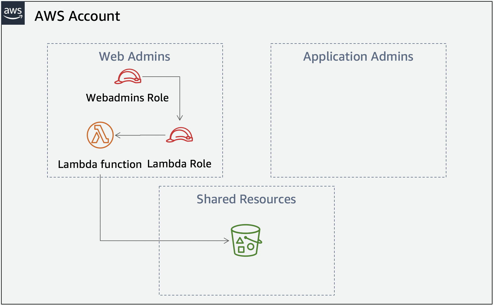

# Permission boundaries workshop 

## <small>Fase de VERIFICAÇÃO</small>

Agora é a hora da **VERIFICAÇÃO** das configurações realizadas pelos administradores colocando o chapéu de webadmins. Como webadmins você irá realizar o seguinte:
It's now time **VERIFY** the setup the admins did by putting on the webadmins hat. As the webadmins you will check that you can do the following: 

1. Criar uma política do IAM (usando o perfil de webadmins)
2. Criar uma Role do IAM (anexar a política criada como webadmins)
3. Criar uma função Lambda (anexar a role criada como webadmins)

Se você está participando de um evento da AWS você deve ter recebido um formulário contendo as seguintes informações de outro time. Você precisará do **Account ID** e do **Resource Restriction** para completar as tarefas nesta fase.

```
Webadmins role ARN:	arn:aws:iam::`ACCOUNT_ID_FROM_OTHER_TEAM`:role/webadmins
Resource Restriction ("path" que deve ser utilizado para roles e políticas): /webadmins/`????`
Permissions boundary name: webadminspermissionsboundary
Permission policy name: webadminspermissionpolicy
```

* Para executar as tarefas como webadmins, você vai precisar assumir a role webadmins. Para facilitar este processo, adicione o conteúdo a seguir ao arquivo `~/.aws/config`:

```
[profile webadmins]
role_arn = arn:aws:iam::ACCOUNT_ID_FROM_OTHER_TEAM:role/webadmins
source_profile = default
```

**Quando você quiser executar um comando referenciando outro perfil diferente do default, adicione o parametro `--profile` do aws_CLI na linha de comando. Como estamos chamando esse perfil de webadmins você verá que `--profile webadmins` foi adicionado ao final de todos os comandos nesta fase.**


!!! **Informação** "Arquitetura da aplicação"



---

!!! **Atenção**
<p style="font-size:16px;">
      Como na fase de Construção, tenha em mente que você precisa adicinonar o Account ID, usar corretamente o "path" e alterar a região especificada caso necessário (caso esteja participando de um evento da AWS, simplemente utilize a região especificada us-east-2). Você também precisa usar o parametro `--profile` em todos os comandos para as tarefas a seguir.
</p>

## Tarefa 1 - <small>Criar a política</small>
	
Primeiramente você criará a política de permissionamento que permitirá somente as ações Create log groups, create log streams, put logs e s3:ListBucket. Você está no fervor do dia a dia, como muitos desenvolvedores e dará acesso total ao S3 para a role. A política que criaremos aqui será anexada a uma role criada durante **Tarefa 2** que então será anexada a uma função Lambda criada durante a **Tarefa 3**.

* Use o JSON a seguir para criar um arquivo chamado **`verifypolicydoc.json`**:
```json
{
  "Version": "2012-10-17",
  "Statement": [
    {
      "Effect": "Allow",
      "Action": [
        "logs:CreateLogGroup",
        "logs:CreateLogStream",
        "logs:PutLogEvents",
        "s3:*"
      ],
      "Resource": "*"
    }
  ]
}
```
* Crie a política 
```
aws iam create-policy --policy-name NAME_OF_POLICY --policy-document file://verifypolicydoc.json --profile webadmins
```
(**Note que existe um parâmetro chave faltando no comando acima. Como webadmins, possuímos uma restrição na criação de recursos como Políticas do IAM**) **Visite <a href="https://docs.aws.amazon.com/cli/latest/reference/" target="_blank"> Documentação AWS CLI para mais informações. </a>**

<details closed>
	
* Comando contendo o parâmetro `--path` faltante (Resource Restrictions). 
```
aws iam create-policy --policy-name NAME_OF_POLICY --path /webadmins/????/ --policy-document file://verifypolicydoc.json
```

</details>

## Task 2 - <small>Criar a role</small>

A role que você vai criar aqui será anexada a função Lambda que você criará no próximo passo.

* Use o JSOM a seguir para criar um arquivo chamado **`verifytrustpolicy.json`**:
```json
{
  "Version": "2012-10-17",
  "Statement": {
    "Effect": "Allow",
    "Principal": {
      "Service": "lambda.amazonaws.com"
    },
    "Action": "sts:AssumeRole"
  }
}
```
* Crie a role
```
aws iam create-role --role-name NAME_OF_ROLE --path /webadmins/????/ --assume-role-policy-document file://verifytrustpolicy.json --profile webadmins
```
(**Note que existe um outro parâmetro chave faltando no comando acima. Como webadmins, precisamos temos nosso perímetro de acões limitado "permissions boundary" e sempre que criamos roles ou usuários precisamos adicionar esses limites limitando as ações deles também.**)**Visite <a href="https://docs.aws.amazon.com/cli/latest/reference/" target="_blank"> Documentação AWS CLI para mais informações. </a>** 

<details closed>
	
* Comando contendo o parâmetro `--permissions-boundary` faltante. 
```
aws iam create-role --role-name NAME_OF_ROLE --path /webadmins/????/ --assume-role-policy-document file://verifytrustpolicy.json --permissions-boundary arn:aws:iam::ACCOUNT_ID_FROM_OTHER_TEAM:policy/webadminspermissionsboundary
```

</details>

* Anexe a política criada na **Tarefa 1** na role:
```
aws iam attach-role-policy --policy-arn arn:aws:iam::<ACCOUNT_ID_FROM_OTHER_TEAM>:policy/webadmins/NAME_OF_POLICY --role-name NAME_OF_ROLE --profile webadmins
```

## Tarefa 3 - <small>Criar e testar a função Lambda</small>

Finalmente, você irá criar uma função Lambda usando **Node.js 8.10**, para isso use o codigo de exemplo abaixo e passe a role do IAM criada no passo anterior:

* Crie um arquivo chamado **`index.js`** usando o código abaixo. Altere `"SHARED_LOGGING_BUCKET_NAME"` com o nome do bucket que inicia com `"shared-logging-"` e termina com `"-data"`. (Para obter o nome do bucket, execute o comando `aws s3 ls --profile webadmins`)

``` node
const AWS = require('aws-sdk');
const s3 = new AWS.S3();

exports.handler = async (event) => {
  console.log('Loading function');
  const allKeys = [];
  await getKeys({ Bucket: 'SHARED_LOGGING_BUCKET_NAME' , Prefix: 'webadmins'}, allKeys);
  return allKeys;
};

async function getKeys(params, keys){
  const response = await s3.listObjectsV2(params).promise();
  response.Contents.forEach(obj => keys.push(obj.Key));

  if (response.IsTruncated) {
    const newParams = Object.assign({}, params);
    newParams.ContinuationToken = response.NextContinuationToken;
    await getKeys(newParams, keys); 
  }
}
```
* Compacte o arquivo index.js para fazer o upload para o Lambda
```
zip lambdafunction.zip index.js
```
* Crie a função Lambda
```
aws lambda create-function --function-name verifyfunction --runtime nodejs8.10 --role arn:aws:iam::<ACCOUNT_ID_FROM_OTHER_TEAM>:role/webadmins/NAME_OF_ROLE --handler index.handler --region us-east-2 --zip-file fileb://lambdafunction.zip --profile webadmins
```
* Invoque a funçnao Lambda para ter certeza que ela está gerando logs no Cloudwatch logs e também para validar se ela consegue listar os objetos no bucket.
```
aws lambda invoke --function-name verifyfunction --region us-east-2 --invocation-type RequestResponse outputfile.txt --profile webadmins
```
* Examine o arquivo "outputfile.txt". Ele deverá mostra o número de arquivos de log dentro do bucket S3 que a função Lambda acabou de ler.

Se você ver arquivos marcados como **webadmins/you-should-SEE-this-file--webadmins...** então você teve sucesso ao verificar que os webadmins conseguem fazer o seu trabalho. Parabéns!!

## Tarefa 4 - <small>Limpeza do ambiente</small>

Para remover os recursos criados por este workshop você deve deletar a stack do CloudFormation chamada `Perm-Bound-Adv` (isso também removerá a stack criada para o Cloud9) e também os recursosdo IAM criados por você. Execute os comandos a seguir:

**Delete a role webadmins**:
```
aws iam delete-role --role-name webadmins
```
**Delete a política de permissionamento**:
```
aws iam delete-policy --policy-arn arn:aws:iam::<ACCOUNT_ID>:policy/webadminspermissionpolicy
```
**Delete a "permissions boundary"**:
```
aws iam delete-policy --policy-arn arn:aws:iam::<ACCOUNT_ID>:policy/webadminspermissionsboundary
```
**Delete a stack do CloudFormation**:
```
aws cloudformation delete-stack --stack-name Perm-Bound-Adv
```
